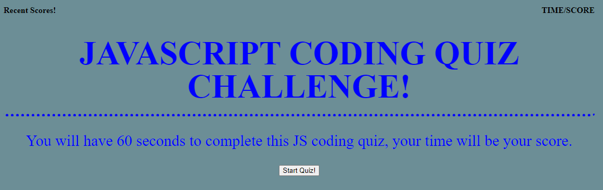

# Jonathan Franklin's Timed Coding Quiz

## Purpose
A webite that will prompt the user to start a timed quiz and after completing the quiz or if time runs out, user will be able to log their score for future viewing.

## Built With
* HTML
* CSS
* JAVA

## Website
https://joncurls.github.io/codeQuiz/

## Thumbnail

## Creator
Made with ❤️ and 💧 by Jonathan F.